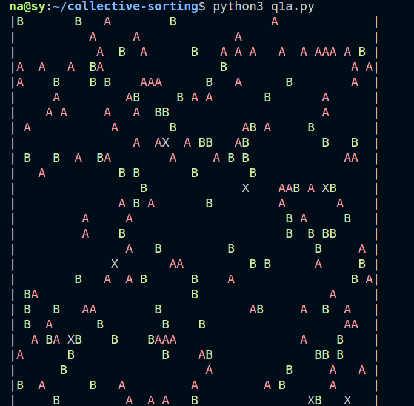
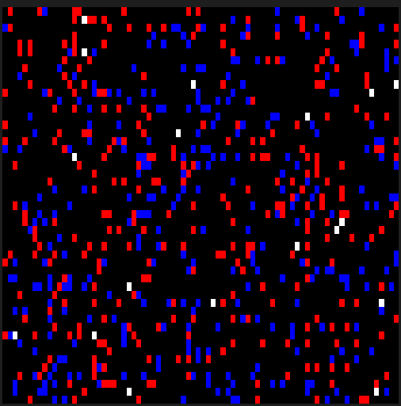
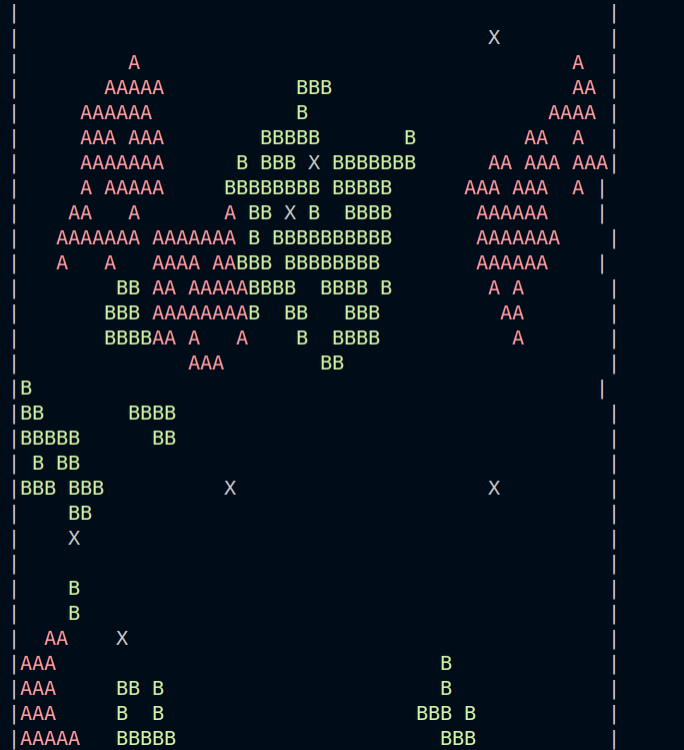
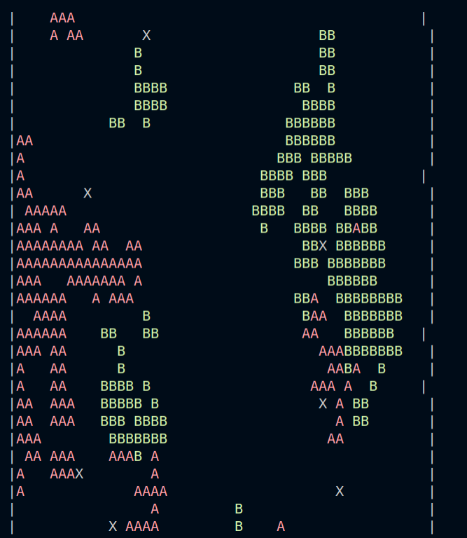

Emna Barred & Nabil Lamrabet

2ème année Master informatique parcours intelligence artificielle

# TP tri collectif multi-agents (collective-sorting)

Il y a 5 fichiers ; 3 fichiers pour la question 1 et 2 fichiers pour la question 2. Il s'agit d'implémentations différentes. Les implémentations qui donnent les meilleurs résultats sont les fichiers `q1a.py` et `q2a.py`.
Nous utilisons `termcolor` pour afficher nos objets en couleur afin de faciliter l'interprétation de matrices.
Pour l'installer : `sudo pip install termcolor`. Sinon commenter les lignes qui font appel à `termcolor`.
Il y a également un affichage en temps réel possible avec `pygame`, il faut pour cela "décommenter" le code commenté dans la fonction `scheduler` et "décommenter" l'import de la bibliothèque.

 

 

## Initialisation et modélisation

On commence par remplir une matrice de dimension N1*N2 avec le caractère '0' qui représente un emplacement vide.

Ensuite on a une fonction `fill_with(number_of_objects, object_type)` qui nous sert à remplir notre matrice aléatoirement un certain nombre d'objets. Ainsi on remplit (par exemple) 200 objets 'A' et 200 objets 'B'. Enfin on a une fonction `fill_agent` qui place dans la matrice un certain nombre d'agent 'X' (il s'agit de leur représentation dans la matrice, les instances de ces agents sont en réalité placés dans une liste).

Nous avons un `scheduler` qui itère sur les agents de cette liste et permet à chaque agent de se déplacer aléatoirement `I` fois pour prendre et déposer des objets.

Dans l'énoncé, il est demandé :

> Une case de l’environnement ne peut contenir à la fois qu’un agent ou un objet ou être vide.

Pour simplifier notre implémentation écrit en python, on décide qu'un agent puisse se trouver sur un objet. En revanche 2 agents ne peuvent se trouver sur un même emplacement et un agent ne peut déposer un objet sur une case ayant un objet.

Il est également dit :

> Un agent se déplace aléatoirement d’un nombre i (i>= 1) de cases, dans l’environnement dans les directions: N,S,E,O. le nombre i est un paramètre que l’on fixe selon l’étendue de l’environnement et le nombre d’agents disponibles.

On considère qu'à chaque déplacement il peut prendre ou déposer un objet. L'agent n'effectue pas i déplacements aléatoires puis décide de prendre ou déposer un objet.

L'agent a une probabilité de prendre un objet et de déposer un objet :

`Pprise= (k+ /(k+ + f))^2`

`Pdépôt= (f/(k-+f))^2`

La probabilité Pprise n'est prise en compte seulement si l'agent est sur une case où un objet est présent et s'il n'a pas déjà d'objet dans les mains.

La probabilité Pdépôt n'est prise en compte seulement si l'agent est sur une case où il n'y a pas d'objet présent et s'il a un objet dans les mains.

On créé une fonction de décision qui nous permet d'effectuer ou non une action en fonction de ces probabilité :

```python
    def decision(self, probability):
        return random.random() < probability
```

## Particularité des implémentations

> f is an estimation of the fraction of nearby points occupied by objects of the same type.

La fonction f qui est utilisée dans les fonction de probabilité représente la proportion d'objets similaires à celui qu'on traite dans le voisinage.

Nous avons essayé 2 fonctions de voisinages :

- Une qui estime le voisinage directement (`q1a.py`)  avec une fonction `self.get_number_of_around(objet)` qui regarde ce que contient les cases Nord, Sud, Est, Ouest (si elles existent) et calcule la proportion de l'objet voulu :

```python
def f(self, encountered_object):
    return self.get_number_of_around(encountered_object)/self.number_of_boxes()
```

```python
def get_number_of_around(self, letter):
    number_around = 0
    if letter in self.get_north():
        number_around += 1
    if letter in self.get_south():
        number_around += 1
    if letter in self.get_east():
        number_around += 1
    if letter in self.get_west():
        number_around += 1
    return number_around
```

L'autre fonction d'estimation de voisinage consiste à regarder la proportion d'un objet dans le voisinage.

> Each ALR has a  short-term memory of m steps, that records what it met in each of the last m time steps. Thus at t=10, a memory of length l0 could hold the string 00AB0AA0B0, indicating that during the previous ten timesteps the robot met 3 objects of type A and 2 of type B, the other points having been empty. fa would be equal to 3/10,and fb to 2/10. As the robot walks randomly, this sampling provides a rough estimation of the density of the nllo sorts of objects in the immediate neighbourhood.

Elle est implémentée dans le fichier `q1b.py` :

```python
    def f(self, encountered_object):
        return self.t.count(encountered_object)/len(self.t)
```

Nous avons également implémenté un agent qui utilise la première fonction de voisinage pour la prise d'objet et la seconde fonction de voisinage pour le dépôt d'objet dans le fichier `q1c.py`

L'implémentation qui nous donne le plus de satisfaction est la première (`q1.py`, cf figure 3), la 3ème implémentation (`q1c.py`) est légèrement meilleure que la 2ème (`q1b.py`) mais elle n'affiche pas de clusters significatifs. On aurait pu également essayer une implémentation qui utilise la seconde fonction f pour la récolte et la première pour le dépôt. On ne s'attardera pas sur les implémentations mixtes pour la question 2.

La première implémentation nous donne un petit nombre de clusters similaire à l'étape 2 de la figure 4 de l'article "The dynamics of collecting sorting robot - like ants and ant - like robot" de J.L. Deneubourg, S. Goss, N. Franks, A. Sendova-Franks, C. Detrain et L. Chrétien (cf figure 3).

## Ajout d'un taux d'erreur sur la reconnaissance d'objet


Pour l'ajout d'un taux d'erreur quant à la reconnaissance des objets, on modifie notre fonction f :
```python

def f(self, encountered_object):
    if encountered_object == 'A':
        return self.f_a()
    else:
        return self.f_b()
```


Nous avons ensuite 2 implémentations, voici celle du fichier `q2a.py` basée sur `q1b.py` :

```python

def f_a(self):
    return (self.get_number_of_around('A') + self.get_number_of_around('B') 
    * ERREUR)/self.number_of_boxes()

def f_b(self):
    return (self.get_number_of_around('B') + self.get_number_of_around('A') 
    * ERREUR)/self.number_of_boxes()
```

Et celle du fichier `q2b.py` basée sur le fichier `q1b.py` :

```python
def f_a(self):
    nb_a = self.t.count('A')
    nb_b = self.t.count('B')
    return (nb_a + nb_b * ERREUR)/len(self.t)

def f_b(self):
    nb_a = self.t.count('A')
    nb_b = self.t.count('B')
    return (nb_b + nb_a * ERREUR)/len(self.t)
```

## Benchmarks, résultats et comparaisons

Nous avons donc essayé nos différentes implémentations. Les fichiers `q1b.py` et `q2b.py` ne nous donnent pas d'amélioration significative par rapport à la matrice de départ. Il s'agit du modèle de l'article "The dynamics of collecting sorting robot - like ants and ant - like robot" cité précedemment. Il se peut donc que ce modèle soit incompatible avec la façon dont nous avons modélisé le problème ou alors simplement une erreur/bug dans l'implémentation des fonctions f.

Nous avons donc fait différents `benchmarks` avec la première implémentation `q1a.py` et `q2a.py`. 

Nous avons voulu le comparer avec la figure 4 de l'article cité précedemment :

>Sorting after 1, 225000 and 1660000 steps. 20 ALRs, 300 o and 300 + objects, k+=0.1, k =0.3, m=15, e=0.2, space=80x49points. Small evenly spaced clusters, containing both types of object but placed adjacently, rapidly form, and later merge into fewerlarger clusærs, with a high degree of sorting.

Donc nous avons utilisé les mêmes paramètres :

```
NUMBER_OF_ITERATIONS = 1660000
NUMBER_OF_AGENTS = 20
K_PLUS = 0.1
K_MOINS = 0.3
NA = 300
NB = 300
T_SIZE = 15
ERREUR = 0.2
N1 = 80
N2 = 49
I = 1
```

Nous obtenons pour le fichier `q1a.py` 3 clusters A et 2 clusters B et quelques petits clusters qui gravitent.
Nous obtenons pour le fichier `q2a.py` (ajout d'erreur) 1 gros cluster A, 1 gros cluster B et quelques petits clusters qui gravitent.

L'affichage réduit les colonnes à 30 et il est difficile d'afficher toutes les lignes des matrices, les captures d'écran ont donc tendance séparer des clusters en 2. En figure 3 et 4 des captures d'écran partiels de résultats finaux de matrices.


 

 
